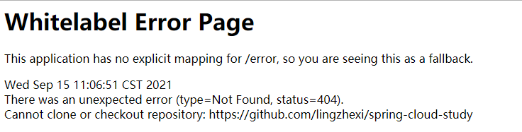
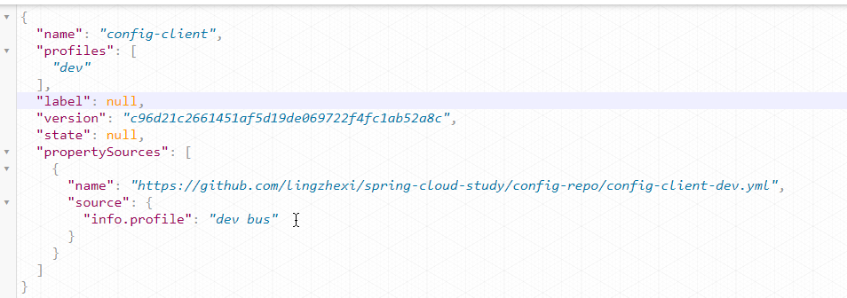
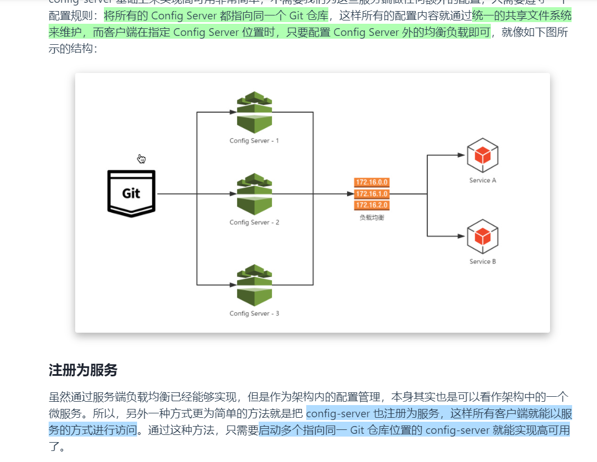

# 工程简介
> Spring Cloud Config 动态配置

## 问题
如果遇到权限问题，需要添加git配置

> spring.cloud.config.server.git.username：访问 Git 仓库的用户名     
spring.cloud.config.server.git.password：访问 Git 仓库的用户密码

点击 [http://localhost:12000/config-client/dev](http://localhost:12000/config-client/dev)  ，访问成功

 

## 配置访问路由
> 仓库中的配置文件会被转换成 Web 接口，访问可以参照以下的规则：     
/{application}/{profile}[/{label}]      
/{application}-{profile}.yml        
/{label}/{application}-{profile}.yml        
/{application}-{profile}.properties     
/{label}/{application}-{profile}.properties     
上面的 URL 会映射{application}-{profile}.yml对应的配置文件，其中{label}对应 Git 上不同的分支，默认为 master。以 config-client-dev.yml 为例子，它的 application 是 config-client，profile 是 dev

## 高可用的动态配置

# 延伸阅读

