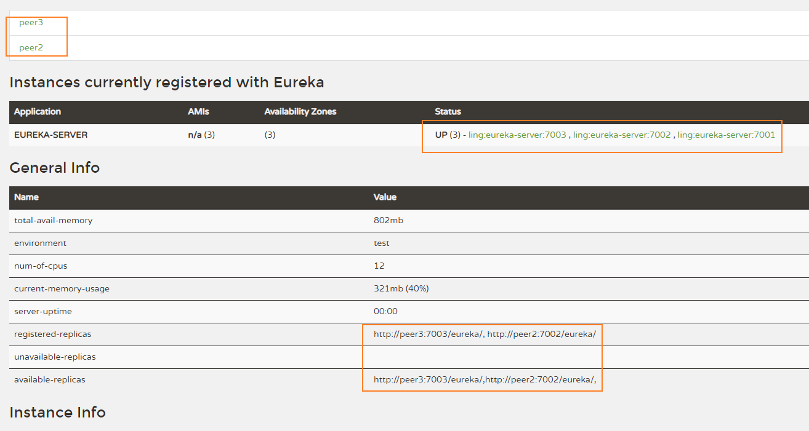

# 工程简介
> Eureka 注册中心三台集群 

## 打包执行
> mvn clean package -Dmaven.test.skip=true      
> java -jar eureka-cluster-0.0.1-SNAPSHOT.jar --spring.profiles.active=peer1        
> java -jar eureka-cluster-0.0.1-SNAPSHOT.jar --spring.profiles.active=peer2        
> java -jar eureka-cluster-0.0.1-SNAPSHOT.jar --spring.profiles.active=peer3

## peer1的Eureka Server

### 注意事项：
eureka.client.service-url:`defaultZone`  <这里的配置的大写的Zone，容易写成defaultzone>
# 延伸阅读

